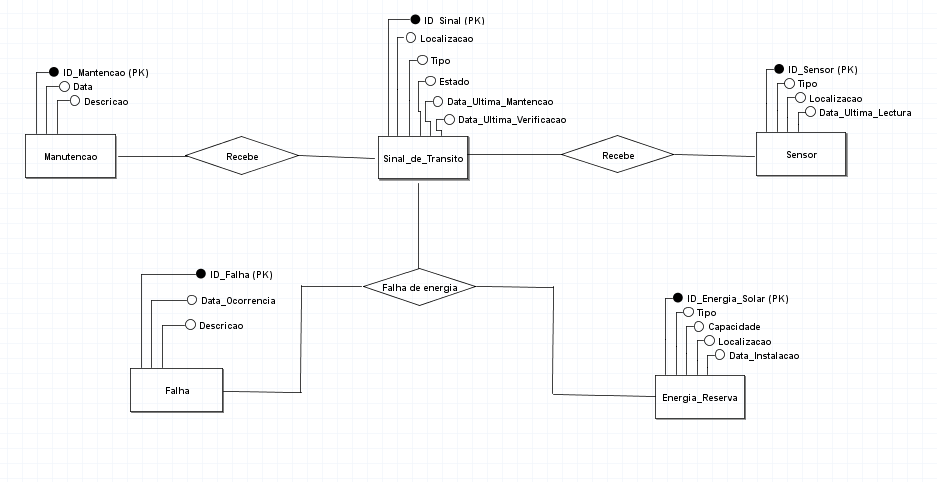

# Problematização de Sinais de Trânsito com Mau Funcionamento Durante Chuvas

Este projeto aborda a problemática dos sinais de trânsito que apresentam mau funcionamento durante chuvas, o que pode causar confusão e aumentar o risco de acidentes nas estradas. O objetivo é identificar os problemas, analisar os impactos e propor soluções para melhorar a segurança viária.

## Objetivos

- **Identificar** os tipos de mau funcionamento dos sinais de trânsito durante chuvas.
- **Analisar** os impactos desses problemas na segurança viária.
- **Propor** soluções para minimizar ou eliminar esses problemas.

## Justificativa

Sinais de trânsito com mau funcionamento durante chuvas representam um risco significativo para motoristas e pedestres. Entender as causas e consequências desses problemas é essencial para desenvolver estratégias de mitigação eficazes.

## Metodologia

1. **Revisão Bibliográfica**: Pesquisa da literatura existente sobre o tema.
2. **Coleta de Dados**: Levantamento de casos reais e estatísticas de acidentes relacionados.
3. **Análise dos Dados**: Estudo dos dados coletados para identificar padrões e causas comuns.
4. **Propostas de Soluções**: Desenvolvimento de soluções práticas e tecnológicas para os problemas identificados.

## Solução Proposta

### Desenvolvimento de um Sistema de Monitoramento e Manutenção Automatizada dos Sinais de Trânsito

O foco é detectar e corrigir falhas durante condições climáticas adversas, como chuvas.

#### Sistema e Utilidade

- **Detecção Antecipada de Problemas**: O sistema é capaz de identificar sinais de mau funcionamento antes que se tornem um problema sério, permitindo intervenções preventivas.
- **Melhoria da Segurança Viária**: Ao garantir que os sinais de trânsito funcionem corretamente mesmo em condições climáticas adversas, contribuímos para a redução de acidentes e para a segurança dos motoristas e pedestres.
- **Eficiência Operacional**: A automatização do processo de monitoramento e manutenção reduz os custos e o tempo necessário para lidar com falhas nos sinais de trânsito.

## Diagrama Conceitual

Aqui está o diagrama conceitual do banco de dados utilizado no projeto:



### Entidades e Relacionamentos

- **Sinal_de_Transito**
  - `ID_Sinal` (int, PRIMARY KEY)
  - `Localizacao` (varchar(255))
  - `Tipo` (varchar(255))
  - `Estado` (varchar(255))
  - `Data_Ultima_Manutencao` (datetime)
  - `Data_Ultima_Verificacao` (datetime)

- **Sensor**
  - `ID_Sensor` (int, PRIMARY KEY)
  - `Tipo` (varchar(255))
  - `Localizacao` (varchar(255))
  - `Data_Ultima_Lectura` (datetime)

- **Manutencao**
  - `ID_Manutencao` (int, PRIMARY KEY)
  - `Data` (datetime)
  - `Descricao` (varchar(255))

- **Falha**
  - `ID_Falha` (int, PRIMARY KEY)
  - `Data_Ocorrencia` (datetime)
  - `Descricao` (varchar(255))

- **Energia_Reserva**
  - `ID_Energia_Solar` (int, PRIMARY KEY)
  - `Tipo` (varchar(255))
  - `Capacidade` (int)
  - `Localizacao` (varchar(255))
  - `Data_Instalacao` (datetime)

### Código SQL do DBdiagram de Banco de Dados

```sql
CREATE TABLE Sinal_de_Transito (
  ID_Sinal int PRIMARY KEY,
  Localizacao varchar(255),
  Tipo varchar(255),
  Estado varchar(255),
  Data_Ultima_Manutencao datetime,
  Data_Ultima_Verificacao datetime
);

CREATE TABLE Sensor (
  ID_Sensor int PRIMARY KEY,
  Tipo varchar(255),
  Localizacao varchar(255),
  Data_Ultima_Lectura datetime
);

CREATE TABLE Manutencao (
  ID_Manutencao int PRIMARY KEY,
  Data datetime,
  Descricao varchar(255)
);

CREATE TABLE Falha (
  ID_Falha int PRIMARY KEY,
  Data_Ocorrencia datetime,
  Descricao varchar(255)
);

CREATE TABLE Energia_Reserva (
  ID_Energia_Solar int PRIMARY KEY,
  Tipo varchar(255),
  Capacidade int,
  Localizacao varchar(255),
  Data_Instalacao datetime
);
```
